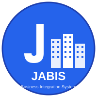

# JABIS (Jinhak Apply Business Integration System)

대학 대상 솔루션 프로그램을 관리하는 통합 시스템입니다.



## 🏗️ 프로젝트 구조

모노레포 구조로 구성되어 있으며, pnpm workspaces를 사용합니다.

```
workspace/
├── apps/
│   ├── backend/          # Express + TypeScript 백엔드
│   │   ├── src/
│   │   │   ├── types/           # TypeScript 타입 정의
│   │   │   ├── repositories/    # 데이터 저장소 (인메모리)
│   │   │   ├── routes/          # API 라우터
│   │   │   ├── data/            # 샘플 데이터
│   │   │   └── index.ts         # 서버 엔트리포인트
│   │   └── package.json
│   └── frontend/         # React + Vite + TypeScript 프론트엔드
│       ├── src/
│       │   ├── components/      # UI 컴포넌트 (Shadcn UI)
│       │   ├── pages/           # 페이지 컴포넌트
│       │   ├── services/        # API 서비스
│       │   ├── types/           # TypeScript 타입 정의
│       │   └── lib/             # 유틸리티 함수
│       └── package.json
├── package.json          # 루트 package.json
└── pnpm-workspace.yaml   # pnpm workspace 설정
```

## 🚀 주요 기능

### 대시보드
- 총 계약 수, 총 매출액, 평균 계약금액 표시
- 지역별 매출액 분석
- 월별 매출액 추이
- 최근 5개 계약 현황

### 계약 관리
- 계약 목록 조회 (필터링: 대학, 담당자, 기간)
- 계약 상세 정보 (기본정보, 제품정보, 담당자, 환경/서버)
- 신규 계약 등록

### 제품 관리
- 제품군별 제품 목록 조회
- 5개 제품군: 입학관리, 학사관리, 포털, 기숙사관리, 취업지원

### 기본정보 관리
- 대한민국 100개 대학 정보 (이름, 지역, 주소, 연락처)
- 담당자 정보 (4개 부서: 영업부, 운영부, 개발부, 솔루션사업부)

## 🛠️ 기술 스택

### Backend
- Node.js + Express
- TypeScript
- CORS 지원
- 인메모리 데이터 저장소

### Frontend
- React 18
- Vite
- TypeScript
- React Router v6
- Shadcn UI (Radix UI + Tailwind CSS)
- Lucide React (아이콘)
- 다크/라이트 테마 지원

## 📦 설치 및 실행

### 사전 요구사항
- Node.js 18+ 
- pnpm

### 설치
```bash
# 루트 디렉토리에서
pnpm install

# 백엔드 패키지 설치
cd apps/backend
pnpm install

# 프론트엔드 패키지 설치
cd apps/frontend
pnpm install
```

### 개발 서버 실행

#### 전체 실행 (동시 실행)
```bash
# 루트 디렉토리에서
pnpm dev
```

#### 개별 실행
```bash
# 백엔드만 실행 (포트: 3001)
pnpm dev:backend

# 프론트엔드만 실행 (포트: 3000)
pnpm dev:frontend
```

### 빌드
```bash
# 전체 빌드
pnpm build

# 개별 빌드
pnpm build:backend
pnpm build:frontend
```

## 🌐 API 엔드포인트

### Health Check
- `GET /api/health` - 서버 상태 확인

### Clients (대학)
- `GET /api/clients` - 전체 대학 목록
- `GET /api/clients/:id` - 대학 상세 정보
- `POST /api/clients` - 대학 등록
- `PUT /api/clients/:id` - 대학 정보 수정
- `DELETE /api/clients/:id` - 대학 삭제

### Persons (담당자)
- `GET /api/persons` - 전체 담당자 목록
- `GET /api/persons?department={department}` - 부서별 담당자
- `POST /api/persons` - 담당자 등록
- `PUT /api/persons/:id` - 담당자 정보 수정
- `DELETE /api/persons/:id` - 담당자 삭제

### Products (제품)
- `GET /api/products/categories` - 제품군 목록
- `GET /api/products` - 전체 제품 목록
- `GET /api/products?categoryId={categoryId}` - 제품군별 제품
- `POST /api/products` - 제품 등록

### Contracts (계약)
- `GET /api/contracts` - 전체 계약 목록
- `GET /api/contracts?clientId={id}&salesPersonId={id}&from={date}&to={date}` - 필터링된 계약
- `GET /api/contracts/:id` - 계약 상세 정보
- `POST /api/contracts` - 계약 등록
- `GET /api/contracts/:id/envs` - 계약 환경 프로필
- `POST /api/contracts/:id/envs` - 환경 프로필 등록

### Stats (통계)
- `GET /api/stats/summary` - 대시보드 통계 데이터

## 📊 샘플 데이터

### 대학 정보
- 대한민국 100개 주요 대학 (서울대, 연세대, 고려대 등)
- 각 대학의 지역, 주소, 대표 연락처 포함

### 담당자
- 4개 부서별 5명씩 총 20명
  - 영업부 (sales)
  - 운영부 (operations)
  - 개발부 (development)
  - 솔루션사업부 (solution)

### 제품
- 5개 제품군
  - 입학관리 솔루션 (3개 제품)
  - 학사관리 솔루션 (3개 제품)
  - 포털 솔루션 (3개 제품)
  - 기숙사관리 솔루션 (2개 제품)
  - 취업지원 솔루션 (2개 제품)

### 샘플 계약
- 10건의 샘플 계약
- 각 계약은 1개 대학과 4개 부서 담당자로 구성
- 다양한 제품 조합 및 할인 정보 포함

## 🎨 UI/UX

- **Shadcn UI**: 현대적이고 접근성 좋은 컴포넌트
- **다크/라이트 테마**: 사용자 선호에 따른 테마 전환
- **반응형 디자인**: 모바일, 태블릿, 데스크톱 지원
- **직관적인 네비게이션**: 사이드바 메뉴

## 📝 라이선스

ISC

## 👨‍💻 개발자

진학 어플라이 개발팀
